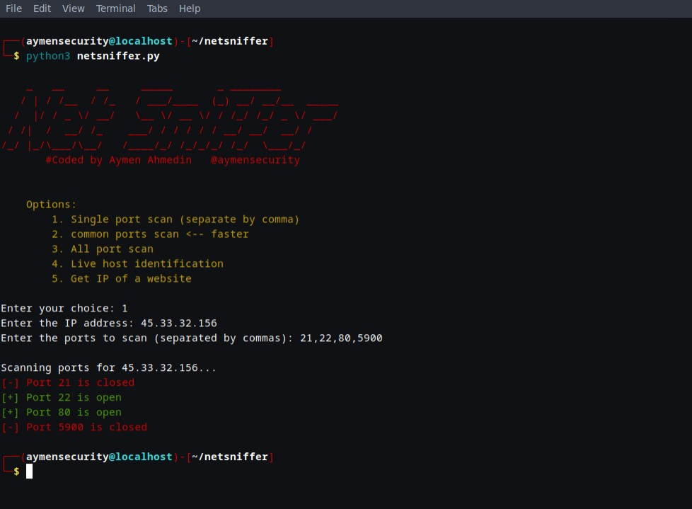

<h2 align="center">NetSniffer</h2>
<h3>NetSniffer: Your essential Linux tool for network reconnaissance and security auditing.</h3>

#Features:

 Scan Open Ports: Identify vulnerabilities and secure your network with pinpoint accuracy.

 Detect Live Hosts: Streamline network management and troubleshooting.
 
 Website IP Resolution: Instantly resolve websites ip address.
 

 
# instaltion 
   - `git clone https://github.com/aymensecurity/netsniffer.git`
   - `cd netsniffer`
   - `pip install -r requirements.txt `
   - `python3 netsniffer.py`
